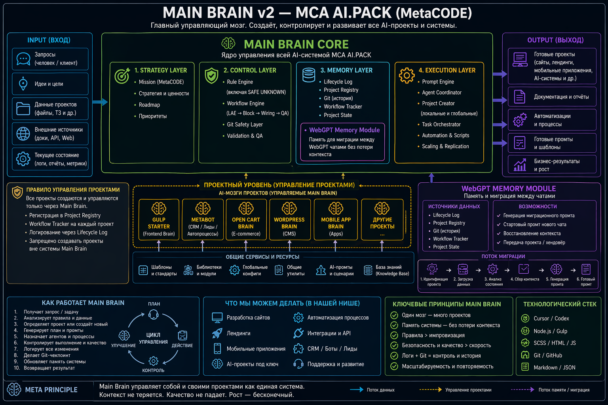

# Main Brain v2 Architecture

## Purpose

Main Brain v2 is the central control layer of MCA AI.Pack.

It creates, controls, logs, validates, and evolves all AI-driven project brains.

## Architecture image

## Core layers

### 1. Strategy Layer

Defines:
- MetaCODE mission
- product direction
- roadmap
- priorities

### 2. Control Layer

Controls:
- rule precedence
- SAFE UNKNOWN MODE
- workflow engine
- Git safety
- validation and QA

### 3. Memory Layer

Stores and reconstructs:
- lifecycle logs
- project registry
- Git history
- workflow trackers
- project state
- WebGPT Memory Module

### 4. Execution Layer

Executes:
- prompt generation
- agent coordination
- project creation
- task orchestration
- scaling and replication

## Project control rule

All projects must be:
- created through Main Brain
- registered in project-registry.md
- controlled via workflow tracker
- logged via lifecycle log
- protected by Git safety checkpoints

## WebGPT Memory Module

The WebGPT Memory Module allows safe migration between chats.

It uses:
- lifecycle-log.md
- project-registry.md
- Git history
- workflow-tracker.md
- project-state.md

It generates:
- migration prompts
- new chat start prompts
- project handoff prompts
- context reconstruction prompts

## What Main Brain can produce

In MetaCODE / web-development niche:
- websites
- landing pages
- mobile applications
- automation systems
- integrations and API workflows
- CRM / lead / bot systems
- AI projects under control

## Operating cycle

1. Receive task
2. Identify project or create project
3. Load rules and context
4. Build plan
5. Generate prompts
6. Execute via Cursor/Codex
7. Validate result
8. Log lifecycle event
9. Commit / push if checkpoint
10. Prepare migration if chat/context changes

## Principle

One Main Brain.
Many project brains.
Single controlled system.
